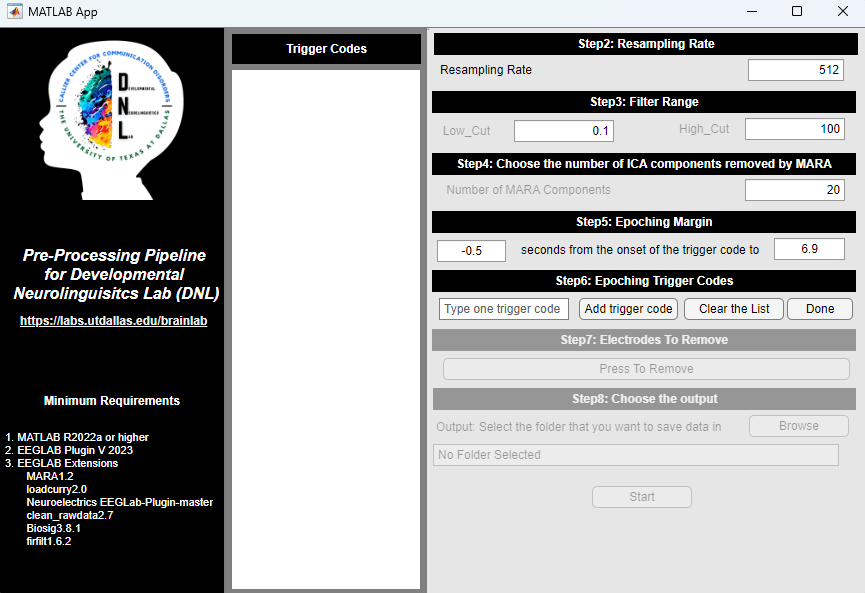

# MATLAB EEG Pre-processing Pipeline App

This MATLAB App provides a graphical user interface (GUI) for cleaning and pre-processing raw EEG data, designed for the Developmental Neurolinguistics Lab (DNL).

## Features

- Step-by-step GUI to guide the user through the pre-processing pipeline.
- Auto-detection of valid files to enter the process
- Interactive environment ot set a variety of options
- Handles `.dat` files from Curry.
- Pipeline steps include: resampling, filtering, artifact rejection with clean_rawdata, ICA, and automated artifact classification with MARA.
- Allows for easy selection of trigger codes, channels to remove, and epoching parameters.

## Minimum Requirements

- MATLAB R2022a or higher
- EEGLAB Plugin V 2023 or higher
- EEGLAB Extensions:
    - MARA (v1.2)
    - loadcurry (v2.0)
    - clean_rawdata (v2.7)
    - Biosig (v3.8.1)
    - firfilt (v1.6.2)

